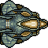
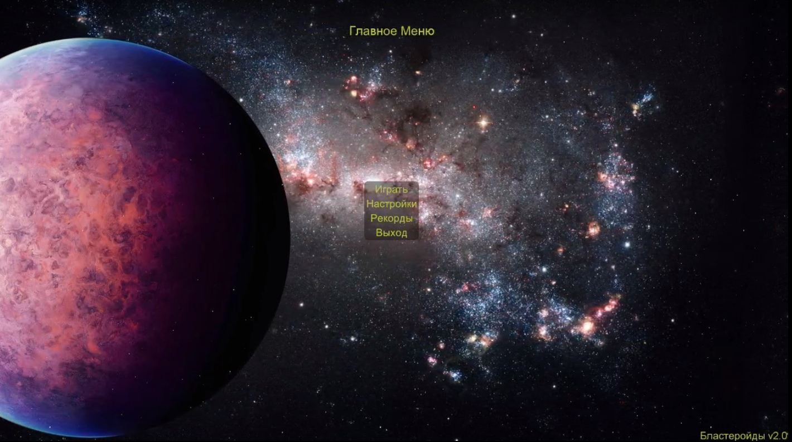
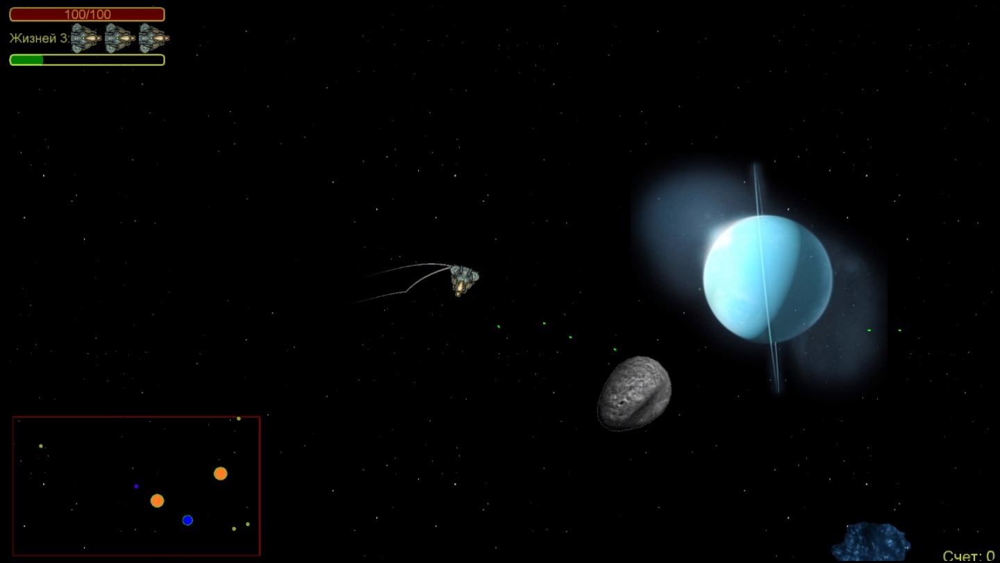
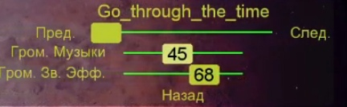

# Бластеройды 2.0

## Про игру

Собственный проект, написанный в свободное время на C++ с использованием бесплатной библиотеки Allegro для работы с графикой, устройствами ввода и музыкой. Написан в 2014 году (первая версия), летом 2016 года (вторая версия).

2D аркада. Вы летаете на космическом корабле, сбивая астероиды, которые могут сбисть вас. Для этого вы пользуетесь сканером (мини-карта), высокомощной плазменной пушкой (бластером корабля), который, помимо обычных выстрелов, со временем заряжается и может выпускать волну вокруг корабля, уничтожающую астероиды. С уничтоженных астероидов могут выпасть ресурсы (бонусы), которые помогут в выживании.

Цель - набрать наибольшее количество очков за уничтожение астероидов.

## Установка / Запуск

Скачать архив по [ссылке](https://disk.yandex.ru/d/JwBw9N_sS3QZvw), разархивировать в любую удобную папку, запустить `Бластеройды 2.0.exe`.

## Инструкция

### Управление

- esc - пауза / настройки / выход
- w, ↑ - ускорение
- s, ↓ - торможение
- a, d, ←, → - поворот корабля
- Пробел, ЛКМ - выстрел
- Левый alt - выпустить волну снарядов (после заполнения шкалы зарядки).

### Интерфейс

### Геймплей

Слева снизу мини-карта (оранжевые - каменные астероиды, синие - железные астероиды)

Слева сверху:

1. Шкала HP
2. Запасные корабли (оставшиеся жизни)
3. Синяя шкала щита (появляется после подбора бонуса щита)
4. Зелёная шкала заряда волны

Справа снизу текущий счёт.

### Настройки

1. Название композиции
2. Плеер (перемотка и переключение композиции)
3. Шкала громкости музыки
4. Шкала громкости звуковых эффектов

## Компиляция

todo (оставить ссылку на аллегро + инструкция к сборке)
